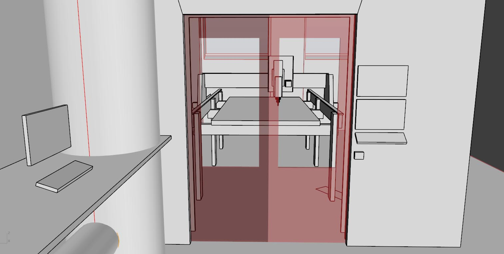

# European ShopBot installations

### The case

* ShopBot milling machines are not certified for public use in most eurpoean countries
* Most Fab Labs and other community workshops have funding and operational restraints that requires EU regulations to be followed

### Our goals

* Increase chances of Fab Labs and other community workshops making government approved installations
* Generally lower the threshold for people worldwide to make safe and pedagogic installations of large format milling machines.
* Avoid doublework in mapping out European rules for shopbot use
* Develop methods that keep machine operators in contact with the machines. Our goal is to help people learn and master tools and technology. [Jinba ittai](https://en.wikipedia.org/wiki/Jinba_ittai) is a Japanese four-character compound describing unity of horse and rider

*Sketch of installation. LEFT: CAM workstation  CENTER: Sliding door with power switch  RIGHT: Operators panel with live camera feed*

### The solution in a nutshell

* Put a door/window or other physical barrier between the ShopBot and ShopBot operator
* Put a safety switch/senor on the door so that the ShopBot will stop if the room is entered

### Current issues

**#1** Some of the ShopBot electronics are not CE approved. Safety switch to the room must completely kill power. Killing power makes it neccessoary to re-home X, Y and Z axis after every entry.

Solutions we are exploring:
* **Stage 1** Add permanent Z homing plate and end stop on Z axis up direction. This way we can add to our post-processors a homing routine for all axes before each job. *(similar to using most 3D printers)*

We are evaulting the following workflow:

1. You place the material on the bed and insert your bit.
2. You close the door and power is enabled to the machine
3. You load the job without zeroing anything. The first lines of the ShopBot code coming out of your fusion/v-carve/mods/bark beetle post processor includes the following zeroing routine:
4. Z axis up until end stop hit (end stop for Z needs to be retrofitted
5. Regular home X Y with end stops
6. Probe Z on a permanently fixed Z zero plate next to the bed
7. You get prompted to start the spindle and press OK
8. Job runs. You follow though the window and though the live feed on the camera inside the skirt
9. Job ends with the machine driving to the back and you enter the room.

Good thing is that we will never have to remind people to Zero X, Y and Z again. Bad thing is people need to learn to work with Zero point underneath the material and specify correct material thickness (you kind of need to get this right anyway though). The shopbot control software needs to  restart every time you you have opened the door. But rebooting the software is quick, and a small price to pay for not having to use the Z plate manually. It is still possible to jog the machine around, as long as the doors are closed.

* **Stage 2** Find a way to not have to kill power to all axes when entering the room. Demands swapping electronic components and possibly the controll software

**#2** Putting the operator outside the ShopBot room reduces the feeling and controll and insights into the machines operation.

Solutions we are exploring:
* Have a short as possible distance between the front of the machines and the user/control panel.
* Use big windows
* Make a super fast, yet safe, autaomtic sliding door that opens with a button press. *(train door style)*
* Have a camera with live feed from inside the dust skirt
* Have a microphone with live feed
* Visualize various sensor data: Sound, vibrations, temperature, power consumption motors, power consumption spindle

**#3** Building garage size shopbot installations with external contractors is expensive

Solutions we are exploring:
* Make open plans Fab Lab operators can download and fabriate on the ShopBot itself. Doors, window frames, wall, ceilings, accoustic panels, camera dust skirt etc.
* Make clear 2D drawings that can be used as for faster project mangagemment and planning when setting up new Fab Labs
* Compile a bill of materials (BOM) of components that meet EU regulations

### Why is the ShopBot dangerous

* Spinning bits can shatter and start fire
* Moving mass can pinch
* Fine dust particles can contaminate lungs
* Loud noise can damage hearing

### The accessories that ShopBot offer

* Handlebars with switches *(apparently not enough to make the machine EU approvable)*
* Keypad for remote controll

### General EU rules

### Country specific rules

### Resources and links

