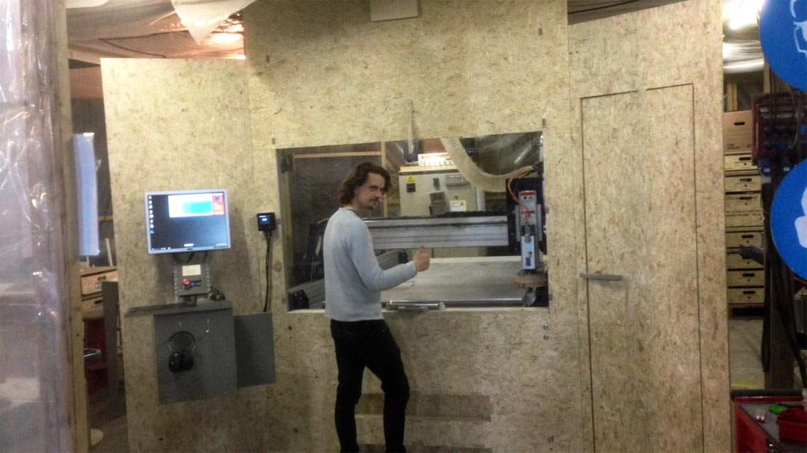

# European ShopBot installations

### The case

* Large format milling machines need special installation to be certified for public use in european countries
* Most Fab Labs and other community workshops have funding and operational restraints that require EU regulations to be followed

### Our goals

* Increase chances of Fab Labs and other community workshops making government approved installations
* Generally lower the threshold for people worldwide to make safe and pedagogic installations of large format milling machines.
* Avoid doublework in mapping out European rules for shopbot use
* Develop methods that keep machine operators in contact with the machines. Our goal is to help people learn and master tools and technology. [Jinba ittai](https://en.wikipedia.org/wiki/Jinba_ittai) is a Japanese four-character compound describing unity of horse and rider

	
*1:1 mockup for testing function and ergonomics of current design*

### The solution in a nutshell

* Put a door/window or other physical barrier between the ShopBot and ShopBot operator
* Put a safety switch/senor on the door so that the ShopBot will stop if the room is entered

### Current issues

**#1** Some of the ShopBot electronics are not CE approved. Safety switch to the room must completely kill power. Killing power makes it neccessoary to re-home X, Y and Z axis after every entry.

Solutions we are exploring:
* **Stage 1** Add permanent Z homing plate and end stop on Z axis up direction. This way we can add to our post-processors a homing routine for all axes before each job. *(similar to using most 3D printers)*

We are evaulting the following workflow:

1. You place the material on the bed and insert your bit.
2. You close the door and power is enabled to the machine
3. You load the job without zeroing anything. The first lines of the ShopBot code coming out of your fusion/v-carve/mods/bark beetle post processor includes the following zeroing routine:
4. Z axis up until end stop hit *(end stop for Z needs to be retrofitted)*
5. Regular home X Y with end stops
6. Probe Z on a permanently fixed Z zero plate next to the bed
7. You get prompted to start the spindle and press OK
8. Job runs. You follow through the window and though the live feed on the camera inside the skirt
9. Job ends with the machine driving to the back and you enter the room.

Good thing is that we will never have to remind people to Zero X, Y and Z again. Bad thing is people need to learn to work with Zero point underneath the material and specify correct material thickness (you kind of need to get this right anyway though). The shopbot control software needs to  restart every time you you have opened the door. But rebooting the software is quick, and a small price to pay for not having to use the Z plate manually. It is still possible to jog the machine around, as long as the doors are closed.

* **Stage 2** Potentially find a way to not have to kill power to all axes when entering the room. Demands swapping electronic components and possibly the controll software

**#2** Putting the operator outside the ShopBot room reduces the feeling and controll and insights into the machines operation.

Solutions we are exploring:
* Have a short as possible distance between the front of the machines and the user/control panel.
* Use big windows
* Make a super fast, yet safe, autaomtic sliding door that opens with a button press. *(train door style)*
* Have a camera with live feed from inside the dust skirt
* Have a microphone with live feed
* Visualize various sensor data: Sound, vibrations, temperature, power consumption motors, power consumption spindle

**#3** Building garage size shopbot installations with external contractors is expensive

Solutions we are exploring:
* Make open plans Fab Lab operators can download and fabriate on the ShopBot itself. Doors, window frames, wall, ceilings, accoustic panels, camera dust skirt etc.
* Make clear 2D drawings that can be used as for faster project mangagemment and planning when setting up new Fab Labs
* Compile a bill of materials (BOM) of components that meet EU regulations

### Why is the ShopBot dangerous

* Spinning bits can shatter and start fire
* Moving mass can pinch
* Fine dust particles can contaminate lungs
* Loud noise can damage hearing

### The accessories that ShopBot offer

* Handlebars with switches *(apparently not enough to make the machine EU approvable)*
* Keypad for remote controll

### General EU rules

### Country specific rules

### Extreal resources and links

### Current solution *(WIP)*

* External switch for Z axis can be connected to input 5 on the ShopBot controll board. Can be read by ShopBot part files/scripts
* The file [XYandZzero.sbp](./ShopBot-config-files/XYandZzero.sbp) runs the an automatic homing routine. It was created by combinging a Shopots Home X Y script, Shopbots Zero Z script and move Z to custom end stop script by Dana Swift.
* [XYandZzero.sbp](./ShopBot-config-files/XYandZzero.sbp) first Zeroes X Y, then moves the head to the specified location of a fixed Z zero plate, than runs the Z Zero routine on the fixed plate and finsihes with moving the Z axis up to maxium position
* [XYandZzero.sbp](./ShopBot-config-files/XYandZzero.sbp) needs to placed in the C:\SbParts folder
* You need to modify the post processor of your CAM program to have this as the first line: **FP,C:\SbParts\XYandZzero.sbp**
* [ShopBot_AutoHomeXYZ_Arc_MM_Spindle_Control.pp](./post-processors/v-carve/ShopBot_AutoHomeXYZ_Arc_MM_Spindle_Control.pp) is an example of a modified PostProcessor for V-Carve
* Custom1, Custom4 and Custom10 are scripts that can be convenient for experienced machine operators. Example: press C+4 on the keyboard to run Custom4, it will bring the machine to a convenient location for manual toolchange

Files are set up and tested and used at your own risk. Be carefull!

Lines to edit for custom setup:
* Line **399**: Change value to so that Z zero will be at top of sacrafacial layer.
* Line **152**: Set the coordiantes of the center of your fixed Z zero plate

### Known bugs

ShopBot moved too fast at one point
* Turning power off to the ShopBot control cabinet, then quickly back on within about 5sec, seem to corrput the speed settings
* Closing the Sb3 application and resarting is reccomended if power has been off the control cabinet

V-Carve does not autmatically adjust home start and end Z height when working with Z zero point bellow material
* But you will get a warning if Z home height is bellow safe Z height. Solution can be to allways have a high Home Z. Can be safe if a Z proximity switch is fully functional.

### To do

**Technical**
* next. make permanent homing plate - DONE.
* make and test mount for z switch - DONE
* fix wiring of z prox switch and z zero plate - DONE
* aquire and test offical ShoBot poximity switch *(current test switch is cheap and unrelibale in heavy dust environment)* DONE, works well on Z axis
* make Z proximity switch stop the Z axis when moving up DONE
* aquire and test offical elctricty braker for sliding doors
* place zero plate in back of machine? reverese homing routine?
* find definate couse of speed error
* make spindle start automatically?
* do general user testing - testing so far is very postivie
* make shopbot software auto close and restart upon connection loss?
* make a previewer program that can preview toolpaths easily and automatically start and close SB3?

**Signage**
* Make overview of signage required in different countries
* Make and add vector files in this repo of grphics that can be replicated in a lab

**Documentation**
* Make info more overvieble
* Make BOM *(Bill of materials)*
* Collect and add external links

